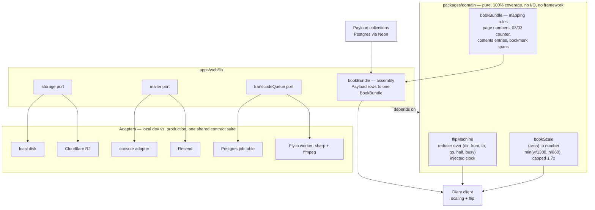

# Architecture

Source: design spec §3 (repository structure), §6 (module seams), §8 (rendering and
routing). This document describes the target structure for the whole project; Phase 0
establishes the workspace and the domain package, later phases fill in `apps/web` and
`apps/transcoder`.

## 1 · Repository structure

```
apps/
  web/                    Next 15 App Router + Payload 3 in-process
    app/(diary)/          public book, galleries          → static + ISR
    app/(admin)/admin/    the bespoke ten-screen panel    → authenticated
    app/(auth)/signin/    password, OTP, reset
    app/(payload)/cms/    Payload's stock admin — dev only, disabled in production
    lib/                  repositories, server actions, adapters
  transcoder/             Node + sharp + ffmpeg worker, queue consumer
packages/
  domain/                 pure logic — no I/O, no framework. 100% coverage.
  tokens/                 handoff colour/type/geometry as CSS variables + typed TS
  ui/                     shared primitives: pill, washi tape, postage stamp, hairline
docs/                     architecture, ADRs, data model, API, runbook, security, testing, QA sweeps
handoff/                  the specification of record
```

`packages/domain` holds everything testable without a browser or a database: the flip
machine, book scaling, page numbering, contents pagination, bookmark spans, the OTP
challenge lifecycle, and the `BookBundle` mappers. It carries the repository's only 100%
coverage gate (`vitest.config.ts`), because every branch in it is a real behaviour rather
than framework glue.

**The rule that matters: `packages/domain` never imports from `apps/`.** Dependencies
run one way — apps and the `apps/web/lib` layer depend on the domain package, never the
reverse. A domain module that reached back into `apps/web` would no longer be testable
without a browser or a database, which defeats the reason the package exists. As of this
task, this is a structural convention stated here and in the design spec (§3), not yet a
lint-enforced import boundary — `eslint.config.js` has no `apps/**` → `packages/domain/**`
restriction wired in. Adding one (e.g. `eslint-plugin-boundaries` or a path-based
`no-restricted-imports` rule) is future hardening, not yet built.

## 2 · Module seams

Four boundaries carry the design's stated failure modes (spec §6). Each is a small
module, independently testable, named in its own header.

| Module | Package | Contract |
|---|---|---|
| `flipMachine` | `packages/domain` | Pure reducer over `{dir, from, to, go, half, busy}` with an injected clock |
| `bookScale` | `packages/domain` | `(area) → number`, `min(w/1300, h/860)` capped at 1.7 |
| `bookBundle` | `packages/domain` + `apps/web/lib` | Payload rows in, one typed `BookBundle` out. The diary client reads nothing else. |
| `storage` / `mailer` / `transcodeQueue` | `apps/web/lib` | Ports with local and production adapters, one shared contract suite run against both |

`BookBundle` is the only serialization boundary between server and diary client — the
diary never learns what a Payload row looks like. `bookBundle`'s pure mapping rules
(what a `BookBundle` looks like, how derived fields like page numbers and the `03 / 33`
counter are computed) live in `packages/domain`; the half that actually reads Payload
rows and assembles one lives in `apps/web/lib`, since touching the database is I/O the
domain package is not allowed to do.



The dotted edge at the bottom of the diagram is half of the rule stated above, drawn:
`apps/web/lib` depends on `packages/domain`. The reverse dependency — domain code
importing from `apps/` — is not drawn at all, deliberately: an arrow reads as something
that happens, and this is something that must never happen. Its prohibition is stated in
prose above, not as a "never" edge that a skimming reader could mistake for a real one.

The `payload` node above is drawn as a plain rectangle rather than a database-cylinder
shape, because Mermaid's `[( )]` cylinder syntax nests awkwardly with a label that itself
needs punctuation, and a rectangle renders identically across Mermaid versions.

`storage`, `mailer` and `transcodeQueue` are the Ports & Adapters pattern named in
`CLAUDE.md` §3.3: a local stand-in (disk, console log, a Postgres table polled directly)
during development, a cloud service in production (R2, Resend, the Fly.io worker
consuming the same Postgres table), and one shared contract test suite run against both
so the two implementations are provably interchangeable.

## 3 · Data flow

1. The author edits content in the admin (`apps/(admin)/admin`), which writes to Payload
   collections in Postgres via typed repository accessors (the Repository pattern —
   the diary never learns what a Payload row looks like).
2. Publishing triggers on-demand revalidation of only the affected static paths.
3. On a request to a diary route, the server assembles one `BookBundle` from the
   relevant Payload rows and statically renders every page's content.
4. The client takes over only for scaling (`bookScale`) and flipping (`flipMachine`);
   it never re-fetches page content mid-session — real paths (`/p/<n>`, `/gallery/<slug>`)
   are written on every turn so deep links stay indexable and shareable.
5. Uploads go straight from the browser to R2 via a presigned URL (never through Vercel,
   which caps request bodies at ~4.5MB); a job row is written to the Postgres queue
   table; the Fly.io worker claims it, runs the `sharp`/`ffmpeg` pipeline, and marks the
   media row `ready` or `failed`.

## 4 · Why each seam exists

- **`flipMachine`** — the flip is four timers and a latch; as an explicit pure reducer
  with an injected clock, illegal states (a seized book, a stranded "busy" flag) become
  unrepresentable and are unit-tested with no browser (spec §7.2).
- **`bookScale`** — the book is authored at a fixed 1300×860 design box and must stay
  resolution-independent at any viewport; extracting the scale function as pure logic
  keeps the 1.7× cap (closing the handoff's known 4K gap) testable without a DOM.
- **`bookBundle`** — one serialization boundary means the diary client's shape can never
  silently drift from what Payload happens to store; a schema change on the Payload side
  is caught at the `bookBundle` assembly step, not scattered across every component that
  reads content.
- **`storage` / `mailer` / `transcodeQueue`** — these are the three points where the app
  talks to a service outside the monorepo. Naming them as ports keeps every provider
  swappable (the mitigation the design spec's risk table records for cloud pricing
  changes) and keeps local development fully working without cloud credentials.
